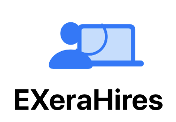
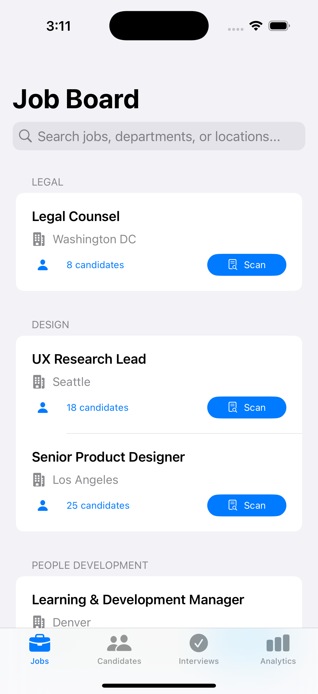
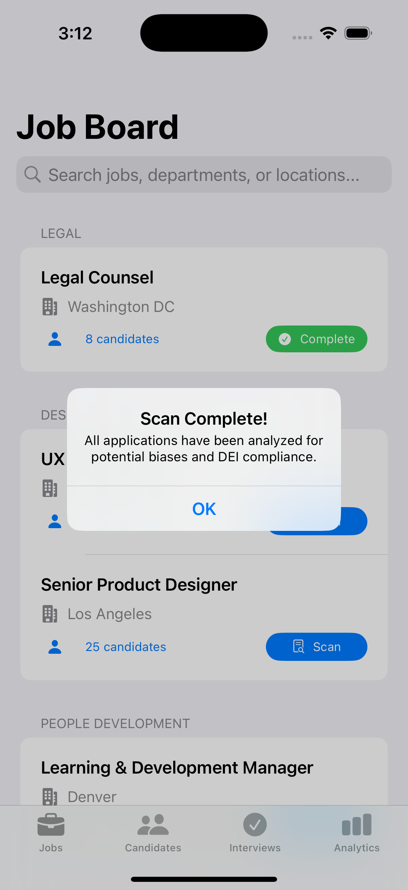
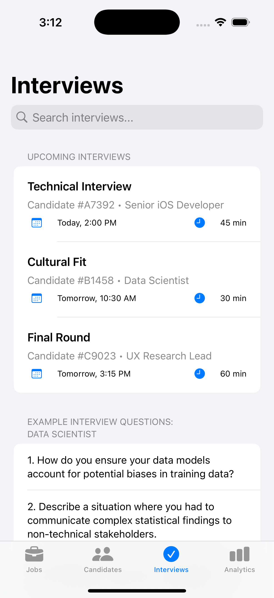
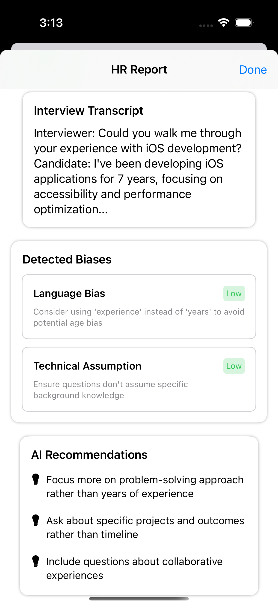
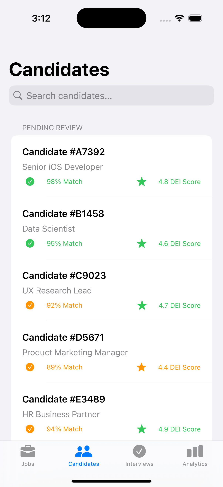
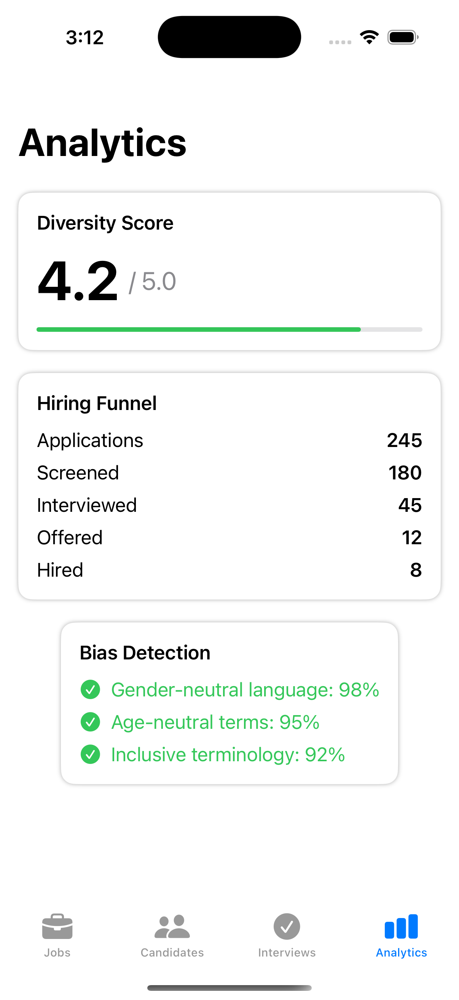

<!-- Improved compatibility of back to top link: See: https://github.com/othneildrew/Best-README-Template/pull/73 -->
<a id="readme-top"></a>
<!--
*** Thanks for checking out the Best-README-Template. If you have a suggestion
*** that would make this better, please fork the repo and create a pull request
*** or simply open an issue with the tag "enhancement".
*** Don't forget to give the project a star!
*** Thanks again! Now go create something AMAZING! :D
-->


<!-- PROJECT SHIELDS -->
<!--
*** I'm using markdown "reference style" links for readability.
*** Reference links are enclosed in brackets [ ] instead of parentheses ( ).
*** See the bottom of this document for the declaration of the reference variables
*** for contributors-url, forks-url, etc. This is an optional, concise syntax you may use.
*** https://www.markdownguide.org/basic-syntax/#reference-style-links

<!-- PROJECT LOGO -->
<br />
<div align="center">
  <a href="https://github.com/ArjunSarkar1/EXeraProject">
    
  </a>

<h3 align="center">Exera Hires AI</h3>

  <p align="center">
    Eliminating Bias, Enhancing Diversity, & Finding the Best Talent
    <br />
    <a href="https://github.com/ArjunSarkar1/ExeraHiresAI"><strong>Explore the docs »</strong></a>
    <br />
    <br />
    <a href="https://gamma.app/docs/Transforming-Hiring-Fairness-h0648j2z173s9m2">View Presentation</a>
    &middot;
    <a href="https://github.com/ArjunSarkar1/ExeraHiresAI/issues/new?labels=bug&template=bug-report---.md">Report Bug</a>
    &middot;
    <a href="https://github.com/ArjunSarkar1/ExeraHiresAI/issues/new?labels=enhancement&template=feature-request---.md">Request Feature</a>
  </p>
</div>


<!-- TABLE OF CONTENTS -->
<details>
  <summary>Table of Contents</summary>
  <ol>
    <li>
      <a href="#about-the-project">About The Project</a>
      <ul>
        <li><a href="#built-with">Built With</a></li>
      </ul>
    </li>
    <li>
      <a href="#getting-started">Getting Started</a>
      <ul>
        <li><a href="#prerequisites">Prerequisites</a></li>
        <li><a href="#installation">Installation</a></li>
      </ul>
    </li>
    <li><a href="#usage">Usage</a></li>
    <ul>
    <a href="#demo">Demo</a>
    </ul>
    <li><a href="#roadmap">Roadmap</a></li>
    <li><a href="#license">License</a></li>
    <li><a href="#contact">Contact</a></li>
    <li><a href="#acknowledgments">Acknowledgments</a></li>
  </ol>
</details>


<!-- ABOUT THE PROJECT -->
## About The Project

The primary purpose of this project is to mitigate bias and maintain diversity in an organiztion utilizing the power of AI.

It's by leveraging AI we will attempt to address this issue all while adhering to the DEI system.

<p align="right">(<a href="#readme-top">back to top</a>)</p>


### Built With

[![Swift][Swift-logo]][Swift-url]

<p align="right">(<a href="#readme-top">back to top</a>)</p>


### Prerequisites

* MacOS operating system (reccomended)
* Development Environment (Xcode or VScode)
* Swift 5.6 or higher

### Installation

1. Clone the repo
   ```sh
   git clone https://github.com/ArjunSarkar1/ExeraHiresAI.git
   ```
2. Run project


<p align="right">(<a href="#readme-top">back to top</a>)</p>


<!-- USAGE EXAMPLES -->
## Usage

Screenshots of the application.

<div class="image-row">
  
  
  
  
  
  
</div>

### Demo

See the [presentation](https://gamma.app/docs/Transforming-Hiring-Fairness-h0648j2z173s9m2) for the full thought process, business pitch and primary objectives.


<p align="right">(<a href="#readme-top">back to top</a>)</p>


<!-- ROADMAP -->
## Roadmap

- **Job Board Section**
    - Scan Applications per role
- **Candidate Selection**
    - Ranked applicants by DEI Score per role
- **Interview Preparations**
    - Set interview dates
    - Curate interview inquiries
    - Model detects biases during meeting recordings
- **Analytics**
    - Summary Report

See the [open issues](https://github.com/ArjunSarkar1/ExeraHiresAi/issues) for a full list of proposed features (and known issues).

<p align="right">(<a href="#readme-top">back to top</a>)</p>


<!-- LICENSE -->
## License

Distributed under the project_license. See `LICENSE.txt` for more information.

<p align="right">(<a href="#readme-top">back to top</a>)</p>


<!-- CONTACT -->
## Contact

Project Link: [https://github.com/ArjunSarkar1/ExeraHiresAI](https://github.com/ArjunSarkar1/ExeraHiresAI)

<p align="right">(<a href="#readme-top">back to top</a>)</p>


<!-- ACKNOWLEDGMENTS -->
## Acknowledgments

* Rebecca Lyons
* Marcelli Walczak

<p align="right">(<a href="#readme-top">back to top</a>)</p>

<!-- MARKDOWN LINKS & IMAGES -->
<!-- https://www.markdownguide.org/basic-syntax/#reference-style-links -->
[contributors-shield]: https://img.shields.io/github/contributors/github_username/repo_name.svg?style=for-the-badge
[contributors-url]: https://github.com/github_username/repo_name/graphs/contributors
[forks-shield]: https://img.shields.io/github/forks/github_username/repo_name.svg?style=for-the-badge
[forks-url]: https://github.com/github_username/repo_name/network/members
[stars-shield]: https://img.shields.io/github/stars/github_username/repo_name.svg?style=for-the-badge
[stars-url]: https://github.com/github_username/repo_name/stargazers
[issues-shield]: https://img.shields.io/github/issues/github_username/repo_name.svg?style=for-the-badge
[issues-url]: https://github.com/github_username/repo_name/issues
[license-shield]: https://img.shields.io/github/license/github_username/repo_name.svg?style=for-the-badge
[license-url]: https://github.com/github_username/repo_name/blob/master/LICENSE.txt
[linkedin-shield]: https://img.shields.io/badge/-LinkedIn-black.svg?style=for-the-badge&logo=linkedin&colorB=555
[linkedin-url]: https://linkedin.com/in/linkedin_username
[product-screenshot]: images/screenshot.png
[Swift-logo]: https://img.shields.io/badge/Swift-FA7343?style=for-the-badge&logo=swift&logoColor=white
[Swift-url]: https://swift.org/
